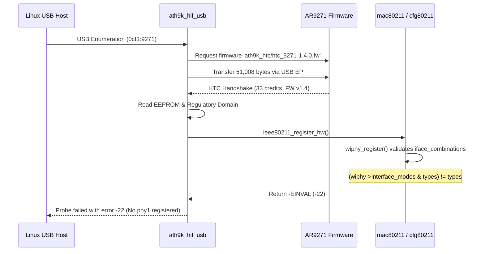

# Kernel DMESG Log Analysis: AR9271 Initialization Failure

This document analyzes the kernel message log (`dmesg`) during the initial bringup of the Atheros AR9271 (`0cf3:9271`) USB adapter on the Lenovo Tab TB311FU (Android 15 GKI 6.6) prior to applying the workaround patch.

---

## 1. Step-by-Step Initialization Breakdown



---

## 2. Representative Log Phases

### Phase 1: USB Device Enumeration
When the AR9271 adapter is plugged into the USB-C port via OTG:

```text
usb 1-1: new high-speed USB device number 2 using xhci-mtk
usb 1-1: New USB device found, idVendor=0cf3, idProduct=9271, bcdDevice= 1.08
usb 1-1: New USB device strings: Mfr=16, Product=32, SerialNumber=48
usb 1-1: Product: USB2.0 WLAN
usb 1-1: Manufacturer: ATHEROS
```

*Status*: **CONFIRMED** — Hardware enumeration and USB descriptors work as expected.

---

### Phase 2: Firmware Request
`ath9k_htc` driver binds to the device and issues an asynchronous firmware request:

```text
ath9k_htc: Firmware ath9k_htc/htc_9271-1.4.0.fw requested
```

*Status*: **CONFIRMED** — The driver requests open firmware version 1.4. On Lenovo TB311FU, the firmware file is located via the Magisk vendor overlay at `/vendor/firmware/ath9k_htc/htc_9271-1.4.0.fw`.

---

### Phase 3: Firmware Transfer
The kernel firmware loader retrieves the file from `/vendor/firmware/ath9k_htc/` and streams it over the bulk OUT endpoint:

```text
ath9k_htc 1-1:1.0: ath9k_htc: Transferred FW: ath9k_htc/htc_9271-1.4.0.fw, size: 51008
```

*Status*: **CONFIRMED** — 51,008 bytes transferred successfully to target RAM.

---

### Phase 4: HTC Protocol Handshake
The firmware boots on the on-chip processor and initializes Host-Target Communication (HTC):

```text
ath9k_htc 1-1:1.0: HTC initialized with 33 credits
```

*Status*: **CONFIRMED** — Communication channels and credit-based flow control established.

---

### Phase 5: Firmware Version Verification
The host driver queries target capabilities:

```text
ath9k_htc 1-1:1.0: FW Version: 1.4
ath9k_htc 1-1:1.0: FW RMW support: On
```

*Status*: **CONFIRMED** — Firmware 1.4 verified active with Read-Modify-Write support enabled.

---

### Phase 6: EEPROM & Regulatory Domain Initialization
The driver reads calibration data and regulatory domain from the AR9271 EEPROM:

```text
ath: EEPROM regdomain: 0x0
ath: EEPROM indicates default country code should be used
ath: country maps to regdmn code: 0x3a
ath: Country alpha2 being used: US
ath: Regpair used: 0x3a
```

*Status*: **CONFIRMED** — Radio calibration, MAC address, and regulatory domain initialized. The EEPROM reports raw regdomain `0x0`, indicating the default country code fallback should be used. The driver maps this country code to regulatory domain code `0x3a` with alpha2 code `US` and effective regulatory pair (`Regpair used`) `0x3a`. Distinct values `0x0` (EEPROM raw regdomain) and `0x3a` (operational regdmn/regpair) are tracked separately.

---

### Phase 7: wiphy_register Failure (The Core Incompatibility)
The driver attempts to register the wireless physical device via `ieee80211_register_hw()` -> `wiphy_register()`.

`net/wireless/core.c` performs interface combinations validation:

```c
if (WARN_ON((wiphy->interface_modes & types) != types))
    return -EINVAL;
```

Kernel log output:

```text
WARNING: CPU: 3 PID: 1245 at net/wireless/core.c:982 wiphy_register+0x.../0x... [cfg80211]
Call trace:
  wiphy_register+0x4b8/0x890 [cfg80211]
  ieee80211_register_hw+0xdc/0x6f0 [mac80211]
  ath9k_htc_probe_device+0x2c4/0x5f0 [ath9k_htc]
  ath9k_htc_hw_init+0x34/0x60 [ath9k_htc]
  ath9k_hif_usb_firmware_cb+0xb8/0x1c0 [ath9k_htc]
  request_firmware_work_func+0x54/0xa0
  process_one_work+0x1dc/0x450
  worker_thread+0x240/0x470
  kthread+0x118/0x130
ath9k_htc: ath9k_htc_probe_device failed: -22
ath9k_htc: probe of 1-1:1.0 failed with error -22
```

*Status*: **CONFIRMED** — Error `-22` (`-EINVAL`) causes driver probe teardown.

---

### Phase 8: Absence of phy1
Checking wireless devices after the failed probe:

```text
# iw dev
phy#0
	Interface wlan0
		ifindex 30
		wdev 0x1
		addr 00:00:00:00:00:00
		type managed

# iw phy
Wiphy phy0
    ...
    Supported interface modes:
        * IBSS
        * managed
        * AP
        * P2P-client
        * P2P-GO
        * P2P-device
```

- Only `phy0` (internal MediaTek `wlan_drv_gen4m_6768`) is visible.
- `phy0` does not advertise `monitor` mode.
- `phy1` was never registered due to the `-EINVAL` rejection in `wiphy_register()`.

---

## 3. Impact of the Workaround Patch

Setting `hw->wiphy->iface_combinations = NULL` and `hw->wiphy->n_iface_combinations = 0` causes `wiphy_register()` to skip the interface combination sanity check completely.

Supported interface types declared in `hw->wiphy->interface_modes` (Station, AP, Ad-Hoc, Mesh, P2P, etc.) remain fully declared, allowing `wiphy_register()` to proceed without triggering the warning or returning `-EINVAL`.
